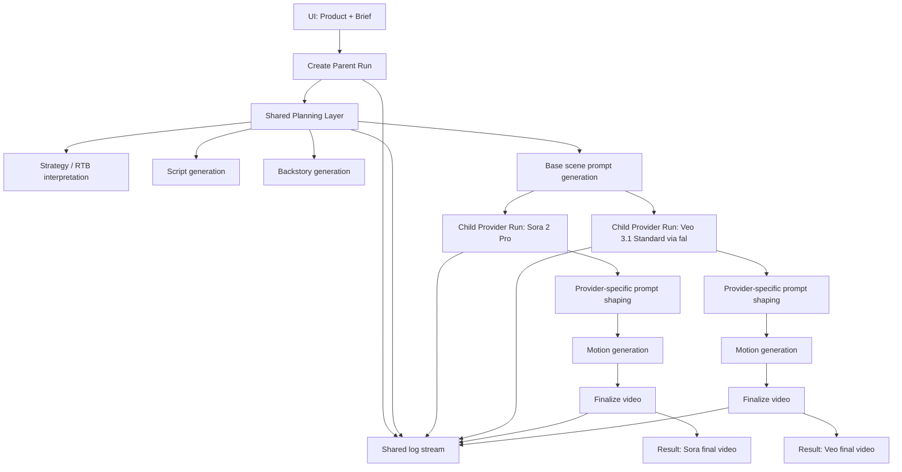
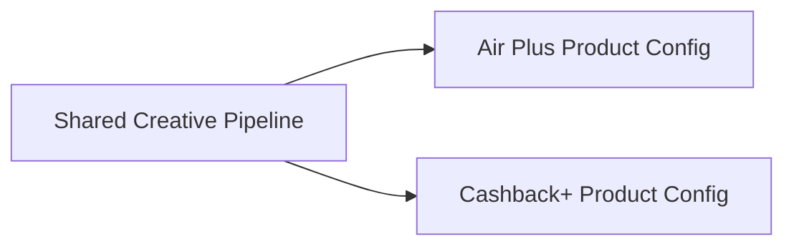

# Air Plus + Cashback+ Dual-Provider Architecture

Date: 2026-03-27

## Objective
Scale the current single-job generation flow into a product-driven system that supports:
- 2 products: Air Plus and Cashback+
- 1 user brief per run
- 2 final videos per run:
  - Sora 2 Pro
  - Veo 3.1 Standard via fal
- simplified UI with:
  - brief input
  - card selector
  - live logs
  - 2 final videos only

Intermediate artifacts should still exist in the backend for debugging and QA, but should not be exposed in the primary UI.

## Locked Assumptions
- 8-second point-to-camera flow first
- same shared planning layer for both providers
- same shared planning layer for both products
- supers disabled for this scale-up phase
- end slate can remain product-specific, but not exposed as a separate UI stage
- one run should create two provider outputs from the same creative foundation

## Design Principle
The user should choose the product and write the brief once.
The system should:
1. interpret the brief once
2. generate shared planning artifacts once
3. fan out into two provider-specific motion branches
4. return two directly comparable finished videos

This keeps provider testing fair and keeps the UI simple.

## High-Level System Diagram

## Product Architecture
There should be one shared pipeline and one product-config layer.

The product config should control:
- product positioning
- audience summary
- psychographics
- supported RTBs / hooks
- supporting facts
- claims to avoid
- image world and mood
- disclaimer logic
- end slate asset
- future supers config

Current storage:
- Air Plus and Cashback+ runtime product configs live in [spec.ts](/Users/neha/Documents/Codex/app/lib/spec.ts)

## Core Runtime Model
### 1. Parent Run
The parent run is the user-facing object.

It should store:
- `id`
- `product`
- `brief`
- `status`
- `createdAt`
- `updatedAt`
- `sharedPlan`
  - interpreted objective
  - script
  - backstory
  - base prompt
- `children`
  - `sora`
  - `veo31_standard`
- `logs`

### 2. Child Provider Run
Each provider child run should store only provider-specific execution state.

It should store:
- `id`
- `parentRunId`
- `provider`
- `status`
- `providerPrompt`
- `rawVideo`
- `finalVideo`
- `error`
- `logs`
- `qc`

## Why Parent + Child Is The Right Model
This is better than creating two unrelated jobs because:
- both providers use the exact same brief foundation
- script and backstory remain consistent
- comparison becomes valid
- retries can happen per provider without rebuilding shared planning
- UI can stay centered around one run instead of many jobs

## Shared Layer vs Provider Layer
### Shared Layer
Runs once per user submission.

Includes:
- product resolution
- brief interpretation
- RTB extraction
- script generation
- backstory generation
- scene-block prompt generation
- claim filtering from product config

### Provider Layer
Runs once per provider.

Includes:
- provider-specific prompt shaping
- provider API call
- polling and retries
- video QC
- finalization

## Proposed Backend Flow
1. User submits:
   - product
   - brief
2. Backend creates parent run
3. Shared planner generates:
   - script
   - backstory
   - base scene prompt
4. Backend creates 2 child runs:
   - Sora
   - Veo
5. Each provider runs independently
6. Each child finalizes its output
7. Parent run is updated with both final URLs and combined logs
8. UI displays only:
   - live logs
   - final Sora video
   - final Veo video

## UI Architecture
### Input
Keep the top section minimal:
- product selector
  - Kotak Air Plus
  - Kotak Cashback+
- brief text area
- generate button

### Output
Show only:
- overall run status
- live log stream
- Sora final video card
- Veo final video card

Do not show in the main UI:
- script JSON
- backstory JSON
- prompt text
- per-step cards
- keyframe previews
- raw artifacts

These should remain available in backend storage for QA and debug routes.

## Log Design
The logs should be product- and provider-aware but still simple.

Recommended log shapes:
- `[shared] brief interpreted`
- `[shared] script generated`
- `[shared] backstory generated`
- `[shared] base prompt generated`
- `[sora] generation started`
- `[sora] poll 18`
- `[veo] generation started`
- `[veo] raw video ready`
- `[sora] final video ready`
- `[veo] final video ready`

This gives progress visibility without exposing internal system complexity.

## API Shape
### Recommended New API
#### `POST /api/runs`
Creates one parent run and starts both provider branches.

Request body:
- `product`
- `brief`
- `durationSeconds`
- `videoType`
- optional `promptVersion`

Response:
- parent run record
- child placeholders for `sora` and `veo31_standard`

#### `GET /api/runs/:id`
Returns the parent run with:
- current overall status
- shared logs
- child statuses
- final video URLs if ready

### Why Not Keep Only `/api/jobs`
The existing `/api/jobs` route is single-job oriented.
That model is correct for one provider, but awkward for side-by-side provider output.

For the scaled product, `/api/runs` should become the primary user-facing route, while `/api/jobs` can remain as a lower-level execution primitive if useful internally.

## Data Model Changes
### Today
Current model is one job with one provider:
- [types.ts](/Users/neha/Documents/Codex/app/lib/types.ts)
- [jobs.ts](/Users/neha/Documents/Codex/app/lib/jobs.ts)
- [route.ts](/Users/neha/Documents/Codex/app/api/jobs/route.ts)

### Target
Add:
- `RunRecord`
- `ProviderRunRecord`
- `RunStatus`
- `ProviderRunStatus`

Keep current `JobRecord` only if it remains as the underlying provider-execution unit.

## Recommended Internal Reuse
Do not build two separate full pipelines.

Reuse current assets:
- product spec layer in [spec.ts](/Users/neha/Documents/Codex/app/lib/spec.ts)
- existing prompt generation pipeline
- existing Sora branch
- existing Veo via fal branch
- existing finalization logic

Refactor only the orchestration:
- shared planning once
- provider fanout twice
- simplified parent-run UI

## Cashback+ Behavior In This Architecture
Cashback+ should use the same pipeline as Air Plus.
Only the product config changes.

What changes for Cashback+:
- positioning
- audience
- psychographics
- hooks / RTBs
- supporting facts
- visual world
- claims to avoid
- disclaimer
- product-specific finishing assets later

What does not change:
- run structure
- prompt-generation stages
- provider fanout model
- UI interaction model

## Recommended Phase-1 Scope
To avoid spreading too wide too early, phase 1 should include:
- Air Plus and Cashback+
- 8-second point-to-camera only
- Sora + Veo dual outputs
- simplified UI
- no supers in the main flow
- product-aware backstory and script logic

This gives a clean comparable system before reintroducing finishing complexity.

## Out of Scope For This Phase
- 15-second flow
- supers customization in the main dual-output UI
- multi-scene product explainers
- adaptation outputs across 1:1 and 16:9
- face-consistent adapt generation
- ranking one provider as the winner automatically

## Risks
### 1. Provider asymmetry
Veo and Sora will not behave the same even with the same base prompt.
This is expected.
The architecture should preserve comparability, not force identical outputs.

### 2. Script fidelity drift
Veo currently has more script drift risk than Sora.
That should be handled by QC and transcript checks, not by UI logic.

### 3. Shared-plan overfitting
If the shared prompt becomes too provider-specific, one provider will degrade.
The shared layer must remain neutral, with provider shaping happening later.

### 4. Product guardrail conflicts
Cashback+ promotional messaging can conflict with fee-table facts.
That must stay encoded in product config so the script layer knows when to phrase claims as promotional.

## Implementation Order
### Step 1
Add parent-run orchestration model.

### Step 2
Refactor backend to generate shared planning artifacts once.

### Step 3
Fan out into child provider runs for:
- Sora
- Veo

### Step 4
Simplify UI to product + brief + logs + 2 final outputs.

### Step 5
Wire Cashback+ fully into the same runtime path.

### Step 6
Add QC gates specific to provider fidelity and script accuracy.

## Recommended Acceptance Criteria
The architecture is ready when:
- one brief submission creates one run with two provider outputs
- both outputs share the same script and backstory source
- the main UI shows no intermediate JSON or internal step panels
- Air Plus and Cashback+ both work through the same orchestration path
- the system can be extended later to 15-second videos without redoing the runtime model
