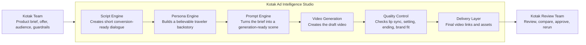
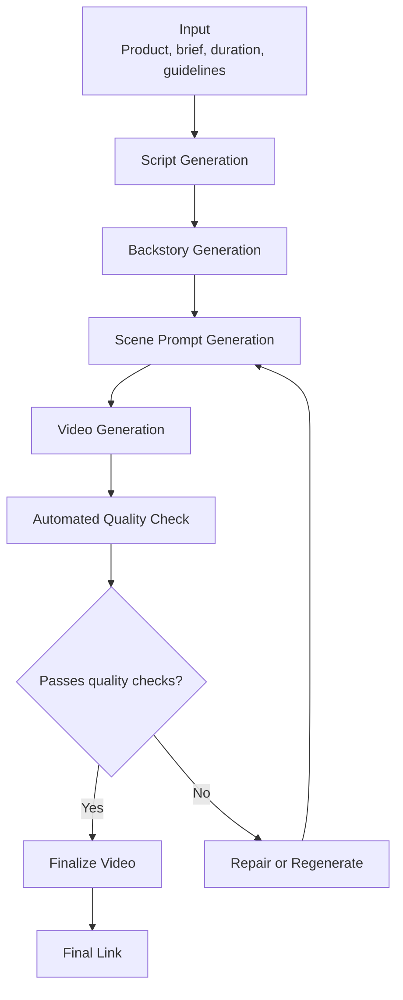
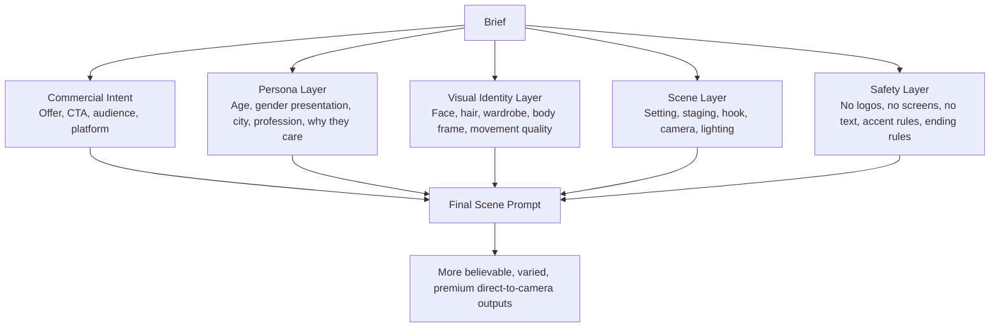
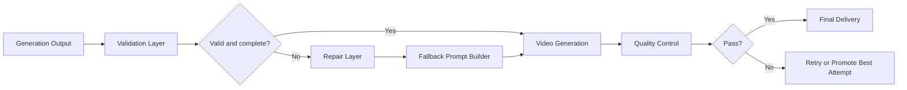
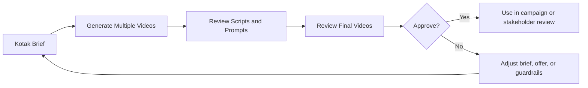
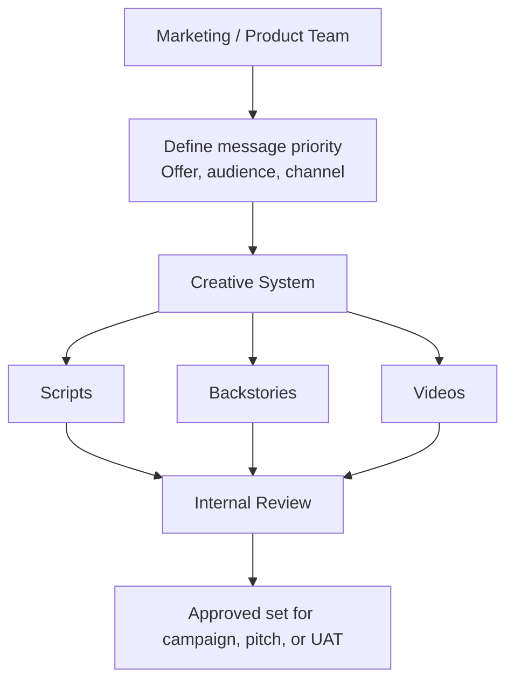

# Kotak Client Architecture Diagrams

Date: March 22, 2026
Purpose: simple architecture views for Kotak stakeholders. These diagrams explain what the system does, how it moves from brief to video, and where quality controls sit.

## 1. Business-Level System View

## 2. Brief-to-Video Generation Flow

## 3. What Drives Better Creative Quality

## 4. Reliability and Guardrail Architecture

## 5. Review and Delivery Workflow

## 6. Operating Model for Kotak

## Suggested Slide Usage

- Slide 1: Diagram 1 for a simple executive overview
- Slide 2: Diagram 2 to explain the end-to-end flow
- Slide 3: Diagram 3 to explain why output quality improved
- Slide 4: Diagram 4 to explain reliability and safeguards
- Slide 5: Diagram 5 or 6 to explain review workflow and how Kotak teams would use it

## Speaker Notes

- Keep the language client-facing. Say "persona engine" or "scene prompt generation," not internal function names.
- Emphasize that the system is not just generating prompts. It is controlling quality across script, character, setting, video generation, and review.
- Call out that quality checks happen after generation, not just before it.
- If asked about failures, explain that the system can retry generation and can also promote the best attempt when needed for review.
