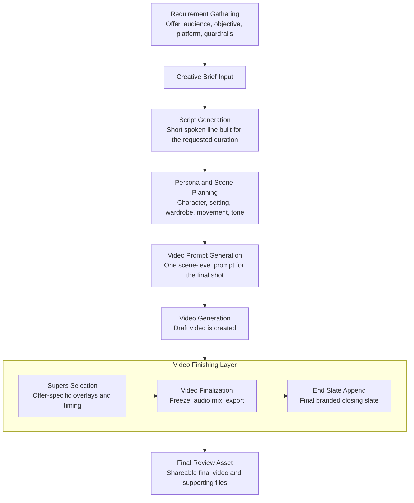
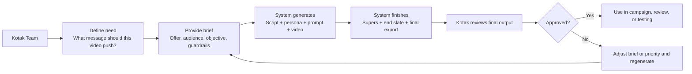

# Kotak Brief-to-Video Architecture

Date: March 24, 2026
Audience: client and stakeholder review
Purpose: explain, in simple terms, how the system moves from a marketing brief to a final video with supers and end slate.

## 1. Simple Architecture Diagram

## 2. What Each Step Does

| Step | What happens | Why it matters |
|---|---|---|
| Requirement Gathering | Team defines the message priority: offer, audience, funnel stage, platform, and brand rules. | Prevents generic output and keeps the system commercially aligned. |
| Creative Brief Input | The brief is entered into the system with duration and product context. | This becomes the operating instruction for the full pipeline. |
| Script Generation | The system writes a duration-fit spoken script. | Keeps the message short, clear, and usable for a real ad. |
| Persona and Scene Planning | The system builds a believable person, setting, wardrobe, and movement style. | Prevents repetitive or generic talking-head outputs. |
| Video Prompt Generation | The system converts the brief and persona into one scene-level prompt. | This controls how the video is visually staged and spoken. |
| Video Generation | The video engine creates the base performance video. | Produces the raw character-led video. |
| Supers Selection | The correct RTB overlay is selected and timed. | Ensures the offer is visible on screen in a brand-consistent way. |
| Video Finalization | The system applies final composition, timing, audio, and export rules. | Turns the raw output into a review-ready asset. |
| End Slate Append | The branded end slate is appended to the final video. | Gives Kotak a consistent finish across outputs. |
| Final Review Asset | Final video and support artifacts are exposed for review. | Makes the work auditable and presentation-ready. |

## 3. Client-Friendly Operating Flow

## 4. Key Design Principles

- The system starts from business intent, not from video generation.
- The offer must survive all the way from brief to final video.
- The character and setting are planned before the video is generated.
- Supers and end slate are treated as part of the final asset, not as separate manual steps.
- Reviewability is built into the flow through intermediate artifacts and final links.

## 5. Final Output Package

The final deliverable can include:

- final video
- raw video
- generated script
- persona and scene plan
- final video prompt
- supers timing/debug output when needed

## 6. Suggested Client Explanation

The system works in six simple stages:

1. define the commercial need
2. convert it into a short ad script
3. create the right person and scene
4. generate the video
5. add the right on-screen RTB and end slate
6. deliver a final review-ready asset
